# Forecasting Net Prophet

## Background

[Mercado Libre](http://investor.mercadolibre.com/investor-relations) is the most popular e-commerce site in Latin America with  with over 200 million users. As a part of this assignment an analysis the company's financial and user data was performed 

As a result of the work on the assignemnt a CoLab notebook was created (link: https://colab.research.google.com/drive/1eAA7kXFp4QlETKHNREfQQhdjF-MT-aw_#scrollTo=3n7lLn8E46oy).  It contains the data preparation, analysis and visualizations for all the time series data and includes the following:

- Visual depictions of seasonality (as measured by Google Search traffic) that are of interest to the company.

- An evaluation of how the company stock price correlates to its Google Search traffic.

- A Prophet forecast model that can predict hourly user search traffic.

- Answers to the questions.

- A plot of a forecast for the company’s future revenue.

The work on the assignment was divided into the following steps including optional fifth one:

- Step 1: Finding unusual patterns in hourly Google search traffic.

- Step 2: Mining the search traffic data for seasonality.

- Step 3: Relating the search traffic to stock price patterns.

- Step 4: Creating a time series model by using Prophet.

- Step 5: Forecasting the revenue by using time series models.

The following subsections detail the results received in each of those steps as well as provide the answers to the questions posed as a part of the assignment.

### Step 1: Finding Unusual Patterns in Hourly Google Search Traffic

It aimed to answer if the Google search traffic for the company links to any financial events at the company. Or, does the search traffic data just present random noise? To answer this question,  any unusual patterns in the Google search data for the company were picked out, and connected to the corporate financial events

Answering the question required to complete the following steps:

1. Reading the search data into a DataFrame, and then slicing the data to just the month of May 2020. (During this month, Mercado Libre released its quarterly financial results.), visualizing the results using hvPlot.

2. Calculating the total search traffic for the month, and then comparing the value to the monthly median across all months.

The outcome is represented on the graph:

Questions:  Do any unusual patterns exist?  
Did the Google search traffic increase during the month that MercadoLibre released its financial results?

Answer: Yes, during the month of May when the MercadoLibre released its financial results the Google search traffic obviously increased. The difference / increase with the median montthly traffic constituted 3,008.5 (38,181 vs 35,172.5).

### Step 2: Mining the Search Traffic Data for Seasonality

If the company's Marketing department can track and predict interest in the company and its platform for any time of day, they can focus their marketing efforts around the times that have the most traffic. This will get a greater return on investment (ROI) from their marketing budget.

To help with it, the search traffic data for predictable seasonal patterns of interest in the company were mined and the following steps completed:

1. The hourly search data were grouped to plot the average traffic by the day of the week.

2. Using hvPlot, this traffic was visualised as a heatmap, referencing hour vs day of week for the axis x and y. 

3. The search data were also grouped by the week of the year. 

The results are represented as follows:

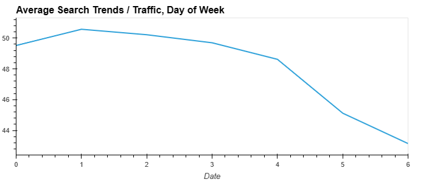
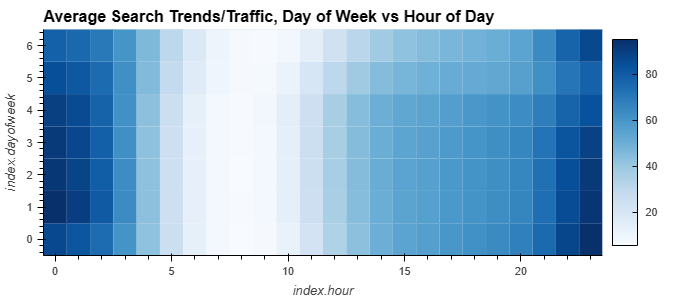
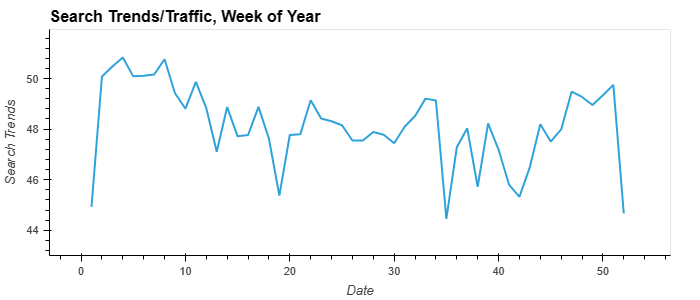

Question: Does any day-of-week effect that you observe concentrate in just a few hours of that day?

Answer: Yes, a certain concentration is observed in between 9 p.m. and 2:30 a.m. from Monday to Thursday and somewhat less on Friday

Question: Does the search traffic tend to increase during the winter holiday period (weeks 40 through 52)?

Answer: Yes, the search traffic growth thrend was observed during the winter holiday period (weeks 40 through 52).

### Step 3: Relating the Search Traffic to Stock Price Patterns

In the attempt to answer the Finance group's inquiry if any relationship between the search data and the company stock price exists the following steps were taken:

1. Reading in and plot the stock price data. Concatenating the stock price data to the search data in a single DataFrame.

2. Slicing the data to the first half of 2020 (`2020-01` to `2020-06` in the DataFrame), and then using hvPlot to plot the data. 

3. Creating a new column in the DataFrame named “Lagged Search Trends” that offsets, or shifts, the search traffic by one hour. Creating two additional columns:

   - “Stock Volatility”, which holds an exponentially weighted four-hour rolling average of the company’s stock volatility

   - “Hourly Stock Return”, which holds the percentage of change in the company stock price on an hourly basis

4. Reviewing  the time series correlation, and then answer the following question.

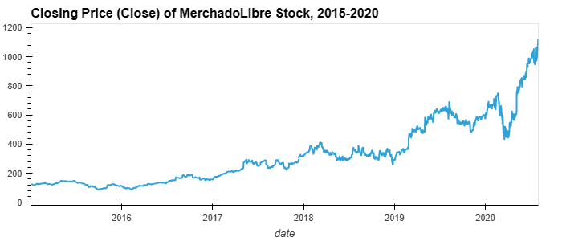

Question: Do both time series indicate a common trend that’s consistent with this narrative?

Answer: Yes, both time series indicate disruption somewhere at the end of March and beginning of April 2020 apparently coinciding with the beginning of COVID-19 pandemic. It followed by the growth caused by the interest in the contactless / distant methods of shopping among the consumers and customers.

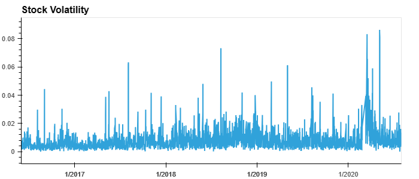

Question: Does a predictable relationship exist between the lagged search traffic and the stock volatility or between the lagged search traffic and the stock price returns?

Answer: Negative correlation is observed between the Lagged Search Trends and the Stock Volatility. Yet, the Lagged Search Trends and the Hourly Stock Return are positively correlated.

### Step 4: Creating a Time Series Model by Using Prophet

A time series model that analyzes and forecasts patterns in the hourly search data was also produced. The following steps were completed to create the model:

1. Setting up up the Google search data for a Prophet forecasting model.

2. Ploting the forecast. What is the near-term forecast for the popularity of Mercado Libre?

3. Ploting the individual time series components of the model to answer the following questions:

The results are represented below:

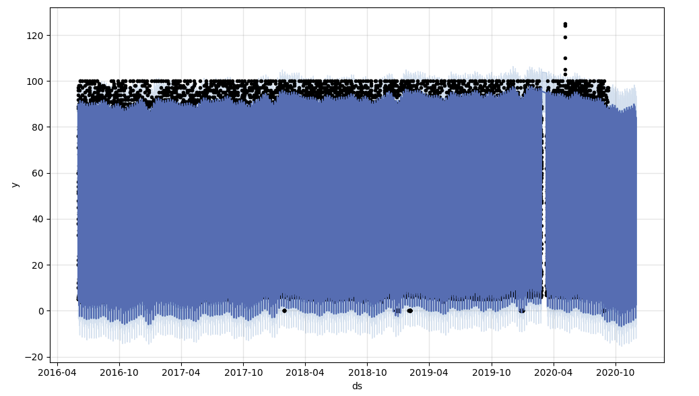

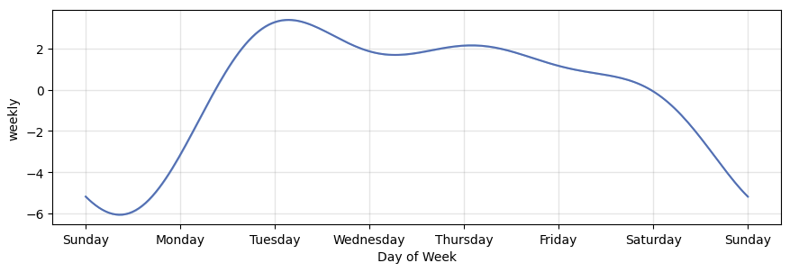
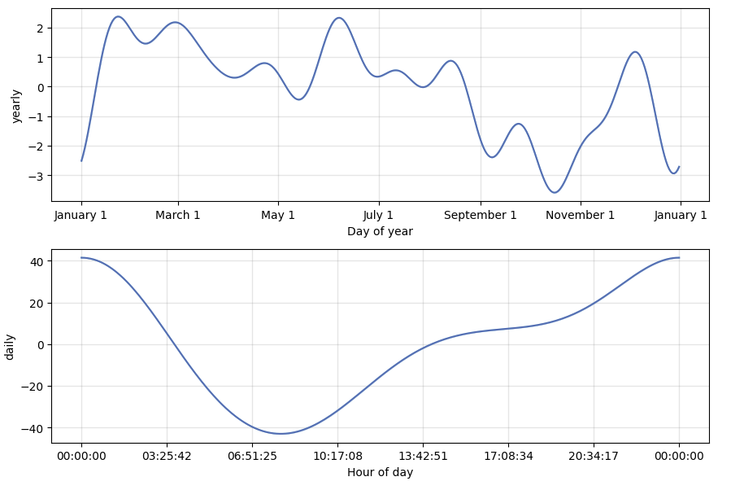

Question: How's the near-term forecast for the popularity of MercadoLibre?

Answer: It shows some decline until the month of October 2020 and the growth after.

Question: What time of day exhibits the greatest popularity?

Answer: Midnight or 00:00:00 shows the greatest popularity.

Question: Which day of week gets the most search traffic?

Answer: The search traffic peak is observed on Tuesday.

Question: What's the lowest point for search traffic in the calendar year?

Answer: The month of October looks like a lowest point.

### Step 5 (Optional): Forecasting the Revenue by Using Time Series Models

This part of the assignment aimed at forecasting the total sales for the next quarter. 

The following steps were completed:

1. Reading in the daily historical sales (that is, revenue) figures, and then apply a Prophet model to the data.

2. Interpreting the model output to identify any seasonal patterns in the company revenue. For example, what are the peak revenue days? (Mondays? Fridays? Something else?)

3. Producing a sales forecast for the finance group. Give them a number for the expected total sales in the next quarter. Include the best- and worst-case scenarios to help them make better plans.

The outcome of the query is on the following graphical representations:

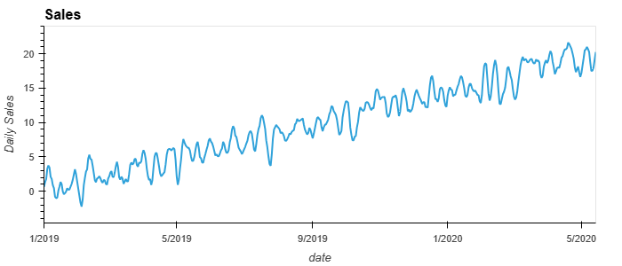
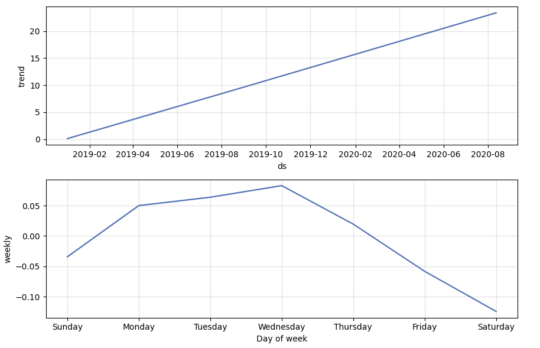
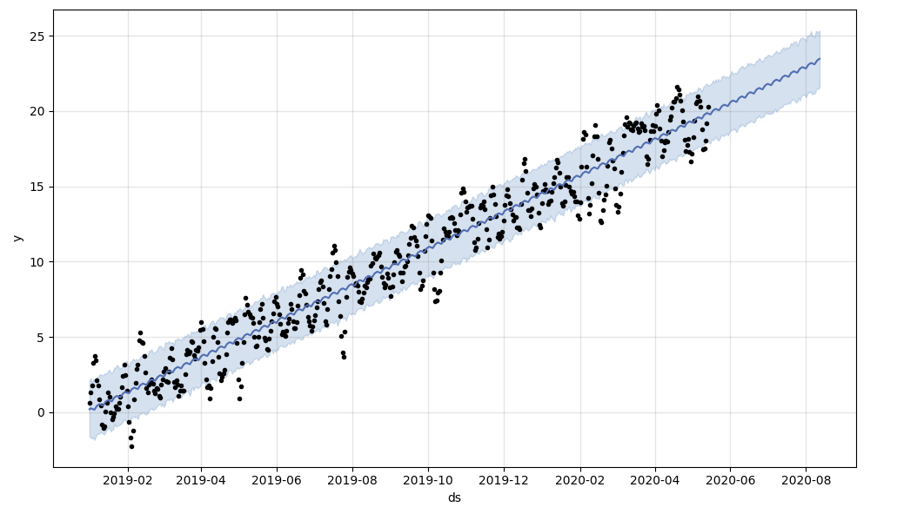

Sales Forecast Synopsis:

Question: What are the peak revenue days? (Mondays? Fridays? Something else?)

Answer: Mondays, Tuesdays, Wednesdays (highest).

Question:  Based on the forecast information generated above, produce a sales forecast for the finance division, giving them a number for expected total sales next quarter. Include best and worst case scenarios, to better help the finance team plan.

Answer: In the next quarter a number for expected total sales most likely is going to be equal to 969.61.  However, in the worst case scenario they can be 887.94 or 1,052.04 in the best case.

## References

The module's instruction materials and texts were extensively consulted and used in the preparation of this README.md file.  This is done purely for the educational purposes. 