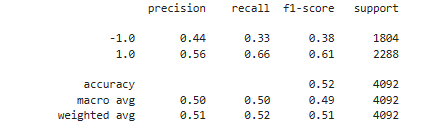

# Analysis Report

## Original Baseline Algorithm

#### Classification Report

#### Algorithm's Cumulative Return vs Actual Return  Graph

According to the classification report the SVM model algorithm has the accuracy equal to 55%, the precision score equal to 43% for the long positions and 56% for the short positions while the recall score is equal to 96% and 4% for the long and short positions correspondingly.  It means good predictions made by the algorithm when buying rather than selling.

The model's cumulative returns visibly mostly exceed actual returns.

## Algorithm with Adjusted Size of Training Data (6 Months vs Original 3 Months)

#### Classification Report 

####  Algorithm's Cumulative Return vs Actual Return Graph

According to the classification report the algorithm's adjustment has insignificantly improved the accuracy.  Here it equals to 56% (vs original 55%). The precision score is equal to 44% (vs 43%) for the long positions and 55% (vs 56%) for the short positions while the recall score is 98% (vs 96%) and 2% (vs 4%) for the long and short positions correspondingly.  As well as with the original / baseline algorithm  it means rather good predictions made by the algorithm when buying rather than selling.

Unlike with the original algorithm the adjusted algorithm's returns are lower than actual returns from the fourth quarter of 2018 through the end of the first quarter of 2020 but then exceed somewhat stronger than with the original algorithm.

## Algorithm with Adjusted Long SMA Input Feature (50 Days vs 100 Days)

#### Classification Report 

####  Algorithm's Cumulative Return vs Actual Return Graph

The algorithm's adjustment led to the insignificantly lower accuracy now equal to 54% (vs 55%).  Similar insignificant changes are observed for the precision score which is now equal to 42% (vs 43%) for long positions and 56% (vs 56%) for short positions. The recall score looks more balanced with  86% (vs 96%) for 'buy' and 13% (vs 4%) for "sell".  Apparently it means improvement of the model for the prediction of good time for selling at the expense of somewhat worse predictions of the good time for buying.

In terms of cumulative return the algorithm changes led to a visible shift of the period where actual returns exceed the algorithm's returns to the end of 2017 through the middle of 2018 in comparison the the results of the previous modification of the algorithm. Yet the algorithm's returns curve lies closer to the actual returns curve unlike it is in the two previous algorithms.

## Logistic Regression Algorithm

#### Classification Report 

#### Logistic Regression Algorithm, Graph

The changes in accuracy and precision here are rather small.  However, the recall score for the logistic regression model is even more balanced than for the algorithm with adjusted long SMA input feature - 33% for "sell" and 66% for "buy".  

The model also has a period when its returns are lower than the actual returns. However the following period gap where the model's cumulative returns exceed the actual returns is visibly wider than for the previous algorithms.  Although the trend reverses in the beginning of 2021 with actual returns again exceeding algorithm's returns. 

## Conclusion

In overall the original baseline algorithm provides better results with the algorithm's returns steadily exceeding actual returns. 
